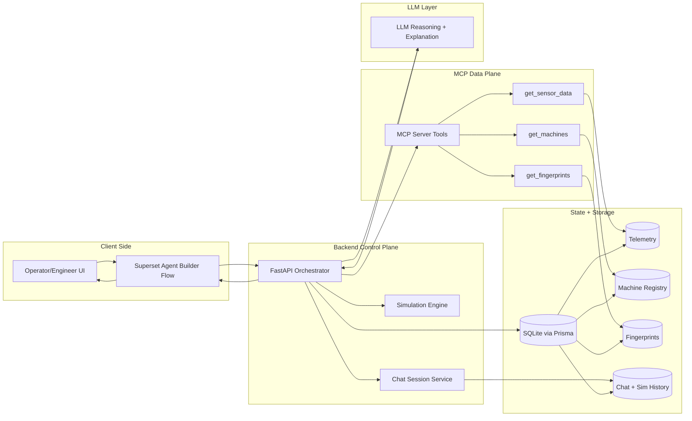

# DriftVeil Agent Builder Challenge Guide

## Objective

This document is the playbook for the hackathon Agent Builder round.

You already have:

- Live drift detection and websocket feed
- Machine and telemetry APIs
- Chat and what-if simulation endpoints
- Persisted chat/simulation models in Prisma

Now the goal is to build a strong visual AI workflow (in Superset Agent Builder) that can handle demo scenarios confidently.

## Project Context (Give This To External LLMs)

DriftVeil is an industrial reliability system for early drift detection and what-if decision support.

Core system behavior:

1. Machine telemetry is streamed (temperature, vibration, optional rpm).
2. Drift detection runs using moving window slope + CUSUM logic.
3. When drift is detected, root-cause reasoning uses a fingerprint library.
4. AI converts technical diagnosis into operator-safe action steps.
5. Users can ask what-if questions (for example, reduce load by 15 percent for 8 hours) and receive simulation-backed recommendations.

Current architecture at a glance:

1. Frontend: React dashboard for operators and engineers.
2. Backend: FastAPI orchestration, websocket feed, chat and simulation endpoints.
3. MCP server: tool-style read layer for machine/telemetry/fingerprint data.
4. DB: SQLite + Prisma models for machines, sensor readings, fingerprints, chat, and what-if simulations.

Operational constraints for hackathon round:

1. Workflow must be explainable to judges in less than 2 minutes.
2. Flow must be robust under typo-heavy user prompts.
3. Output must be strict JSON with no hallucinated numeric projections.
4. Include fallback branches for tool failures and ambiguous user input.
5. Include a high-risk escalation path (human handoff).

---

## Copy-Paste Prompt For Claude (Build The Agent From This README)

Use this exact prompt with Claude.

```text
You are a senior AI workflow architect.

I will give you a README that defines my hackathon target architecture and node patterns.
Your task is to read it and produce a complete, build-ready Agent Builder workflow.

CONTEXT:
- Project: DriftVeil (industrial drift detection + what-if simulation assistant)
- Goal: qualify in top 24 out of 1000 teams
- Platform target: Superset Agent Builder (node-based workflow)
- Requirements: reliability, safety guardrails, explainability, strict JSON outputs

IMPORTANT INSTRUCTIONS:
1) First, read and summarize the README constraints and architecture in 10 bullet points.
2) Then design TWO workflows:
  A. Basic workflow (fast and reliable demo)
  B. Advanced workflow (finalist-level with memory, escalation, retry/fallback)
3) Use node types compatible with Superset style palettes:
  Input, LLM Step, Classifier/Router, Condition/Branch, Tool Call, Memory/Context,
  Human Handoff, Output Formatter, Evaluator/Guardrail, Retry/Fallback, Custom Code, Merge/Join.
4) For each workflow, provide:
  - Node-by-node build order
  - Node name
  - Purpose
  - Input fields
  - Output fields
  - Branch conditions
  - Failure behavior
5) Generate Mermaid diagrams for both workflows.
6) Add an MCP-centric system architecture diagram.
7) Define strict output JSON schemas for:
  - status answer
  - diagnosis answer
  - what-if simulation answer
  - high-risk escalation answer
8) Add guardrail rules that block unsafe recommendations and fabricated numbers.
9) Add a prompt pack:
  - Normalize prompt
  - Router prompt
  - Response composer prompt
  - Safety evaluator prompt
  - Retry repair prompt
10) Add a demo script with 8 user prompts and expected route/path for each.

OUTPUT FORMAT (MANDATORY):
- Section 1: README understanding
- Section 2: Basic workflow
- Section 3: Advanced workflow
- Section 4: MCP architecture
- Section 5: Schemas
- Section 6: Prompt pack
- Section 7: Demo script
- Section 8: Build checklist (time-boxed: 60-minute implementation plan)

Do not give generic advice.
Produce implementation-ready content with explicit nodes and branch logic.
If any requirement is ambiguous, propose a default and continue.

Now read the README below and build the final answer accordingly:

[PASTE README CONTENT HERE]
```

Pro tip:

1. Paste this entire file content where the placeholder says `[PASTE README CONTENT HERE]`.
2. Ask Claude to optimize for "judge explainability + reliability first, complexity second".

---

## Flow Diagrams To Build In Agent Round

### 1) Basic AI Agent (Fast, Reliable, Judge-Friendly)

Use this when you need a clear and stable baseline flow that always works in demo.

```mermaid
flowchart LR
  subgraph U[User Layer]
    U1[User Question]
  end

  subgraph A[Agent Builder Workflow]
    A1[Input Node]
    A2[LLM Step: Normalize Query]
    A3[Classifier Router]
    A4[LLM Step: Compose Answer]
    A5[Guardrail Check]
    A6[Output Formatter JSON]
    A7[Fallback Response]
    A8[Final Response]
  end

  subgraph T[Tool/API Calls]
    T1[GET /api/machines]
    T2[GET /api/machines/{machine_id}/history]
    T3[POST /api/chat/simulate]
  end

  U1 --> A1 --> A2 --> A3

  A3 -- Status --> T1 --> A4
  A3 -- Diagnosis --> T2 --> A4
  A3 -- What-If --> T3 --> A4
  A3 -- Ambiguous --> A7

  A4 --> A5
  A5 -- Pass --> A6 --> A8
  A5 -- Fail --> A7 --> A8
```

Why this wins:

1. Very easy for judges to follow.
2. Fast response with minimal failure points.
3. Good reliability under time pressure.

### 2) Advanced AI Agent (Top-24 Competitive Flow)

Use this when you need high sophistication: memory, risk escalation, retry, fallback, and explainability.

```mermaid
flowchart LR
  subgraph U[User + Session]
    U1[User Query]
    U2[Session Context]
  end

  subgraph W[Agent Builder Orchestration]
    W1[LLM: Normalize]
    W2[Router: Intent]
    W3[Entity Extractor]
    W4[Memory Node]
    W5[Reasoning Aggregator]
    W6[Risk Scorer]
    W7{Risk >= High?}
    W8[LLM: Recommendation]
    W9[Policy Guardrail]
    W10{Policy Pass?}
    W11[Output Formatter]
    W12[Evaluator]
    W13{Schema Valid?}
    W14[Retry Once]
    W15[Safe Fallback]
    W16[Final Response]
    W17[Human Handoff]
  end

  subgraph P[Parallel Tool Calls]
    P1[GET /api/machines]
    P2[GET /api/machines/{machine_id}/history]
    P3[GET /tools/get_fingerprints]
    P4[POST /api/chat/simulate]
  end

  U1 --> W1
  U2 --> W1
  W1 --> W2 --> W3 --> W4

  W4 --> P1 --> W5
  W4 --> P2 --> W5
  W4 --> P3 --> W5
  W4 --> P4 --> W5

  W5 --> W6 --> W7
  W7 -- Yes --> W17 --> W11
  W7 -- No --> W8 --> W9 --> W10
  W10 -- Yes --> W11
  W10 -- No --> W15 --> W11

  W11 --> W12 --> W13
  W13 -- Yes --> W16
  W13 -- No --> W14 --> W13
  W14 --> W15 --> W16
```

Why this wins:

1. Demonstrates production thinking, not just prompting.
2. Shows safety, reliability, and governance.
3. Handles ambiguous and risky cases like real industrial systems.

### 3) MCP-Centric Architecture (Add This To Impress Judges)

Use this as your system-level diagram to explain where MCP fits and why it matters.



Why this wins:

1. Shows clear separation: orchestration, MCP tool access, storage, and LLM.
2. Makes architecture easy to defend in Q and A.
3. Demonstrates enterprise-style design thinking beyond a single prompt chain.

---

## What You Should Build In The Agent Round

### 1) Core Workflow (Must Have)

Build one end-to-end workflow that handles:

1. Understand user question.
2. Route to correct intent:
   - status summary
   - root cause explanation
   - what-if simulation
   - action recommendation
3. Pull machine context.
4. Run simulation when required.
5. Return structured operator-safe response.

### 2) Add-Ons (High Score Boosters)

1. Language normalization node (typos and shorthand support).
2. Safety guardrail node (block unsafe instructions).
3. Confidence score in final output.
4. Human handoff branch for critical risk.
5. Retry/fallback path if a tool call fails.
6. Memory/context node for conversation continuity.

### 3) Demo Reliability Additions

1. Default machine fallback if user does not specify machine id.
2. Friendly fallback when no OpenAI key is present.
3. Timeout fallback response when simulation/tool call is slow.
4. Deterministic canned response mode for stage demos.

---

## Recommended Workflow Graph (Superset Node Mapping)

Build it in this exact node order so judges can follow the logic quickly.

### Basic Graph (Node-by-Node)

1. Input
- Capture: `message`, `machine_id`, `session_id` (optional).

2. LLM Step: Normalize Query
- Fix typos and normalize intent text.
- Output fields: `normalized_query`, `machine_id_resolved`.

3. Classifier / Router
- Branch into: `status`, `diagnosis`, `what_if`, `ambiguous`.

4. Tool Call Nodes
- `status` -> `GET /api/machines`
- `diagnosis` -> `GET /api/machines/{machine_id}/history`
- `what_if` -> `POST /api/chat/simulate`
- `ambiguous` -> go straight to fallback clarification response.

5. LLM Step: Compose Answer
- Convert tool output to concise operator language.

6. Evaluator / Guardrail
- Reject unsafe or fabricated outputs.

7. Output Formatter
- Return strict JSON schema:
  - `summary`
  - `what_happens`
  - `risk_level`
  - `recommended_action`
  - `assumptions`
  - `confidence`

8. Retry / Fallback
- If guardrail fails or tool fails, return safe fallback + next step.

### Advanced Graph (Finalist Version)

1. Input -> LLM Normalize -> Router -> Entity Extractor.
2. Memory/Context node enriches with past session assumptions.
3. Parallel Tool Calls fan out:
- `GET /api/machines`
- `GET /api/machines/{machine_id}/history`
- `GET /tools/get_fingerprints`
- `POST /api/chat/simulate`
4. Reasoning Aggregator merges all tool payloads.
5. Risk Scorer -> Condition/Branch (`risk >= high`).
6. High risk path -> Human Handoff node.
7. Normal risk path -> LLM Recommendation -> Policy Guardrail.
8. Output Formatter -> Evaluator (schema + factual checks).
9. Retry once if invalid, otherwise fallback template.

---

## Demo Scenarios You Should Prepare

Prepare at least these 8 prompts and expected behavior:

1. "Why is MCH-03 drifting right now?"
- Route: diagnosis
- Output: trend summary + likely fault + immediate action

2. "If I reduce load by 15 percent for 8 hours, what happens?"
- Route: simulation
- Output: projected temp/vibration/risk

3. "Can we run this machine till tomorrow morning?"
- Route: recommendation + simulation
- Output: yes/no with caveats and confidence

4. "What is the safest action in next 30 minutes?"
- Route: recommendation
- Output: top action + rationale + check interval

5. "Compare MCH-03 and MCH-04 risk now."
- Route: status summary
- Output: ranked risk + key metric deltas

6. "I changed rpm by 20 percent, now what?"
- Route: simulation
- Output: post-intervention forecast

7. "Tell me root cause in simple words."
- Route: diagnosis with simplified explanation

8. Ambiguous input: "what now"
- Route: ambiguous branch
- Output: ask clarifying question with quick options

---

## What To Add In Your Existing DriftVeil App Before Round

### Backend

1. Add a small `GET /api/chat/health` endpoint returning DB + simulation readiness.
2. Add response schema validation before returning chatbot payload.
3. Add lightweight prompt/output logging for judge walkthrough.
4. Add `demo_mode=true` flag to return stable deterministic answers if needed.

### Frontend

1. Add prompt chips in chat UI:
   - Reduce load 10%
   - Run 8 hours
   - Safest immediate action
2. Add simulation result card under each assistant answer.
3. Add clear assumptions panel for trust.
4. Add critical banner when risk high and handoff suggested.

### Data

1. Ensure at least 2-3 machines have distinct drift patterns.
2. Seed one strong drift case and one borderline warning case.
3. Seed at least 3 fingerprints with different recommended actions.

---

## Judging-Focused Features (What Usually Wins)

1. Reliable routing accuracy under messy user input.
2. Clear separation of deterministic simulation and LLM explanation.
3. Explainability: assumptions + confidence + why this recommendation.
4. Safety: explicit do-not-do actions for risky situations.
5. Graceful fallback when services or key are unavailable.

---

## Practice Platform Recommendation

Best order to practice:

1. Superset Agent Builder sandbox (primary)
- Use this first if you have access, because challenge scoring depends on this UX.

2. Langflow (best visual analog)
- Great for quick node graph experiments with router, tool-call, and memory blocks.
- Practice: [https://www.langflow.org/](https://www.langflow.org/)

3. Flowise or Dify (workflow rehearsal)
- Useful for testing branch-heavy RAG/tool flows quickly.
- Flowise: [https://flowiseai.com/](https://flowiseai.com/)
- Dify: [https://dify.ai/](https://dify.ai/)

4. n8n (fallback for robust orchestration drills)
- Good for retries, branching, and API reliability testing.
- Practice: [https://n8n.io/](https://n8n.io/)

5. Local API rehearsal (mandatory)
- Use your own backend endpoints as tool calls so workflow logic mirrors final demo.

Note on Superset link:

- Use the official challenge environment link provided by organizers in the hackathon portal/email.

Recommended practical stack for one-week prep:

- Day 1-2: Local backend + Langflow dry runs.
- Day 3-4: Move graph to Superset Agent Builder.
- Day 5: Stress test fallback and ambiguous prompts.
- Day 6: Freeze prompt/template and run 10 full demos.

---

## API Endpoints To Use As Tool Nodes

From current DriftVeil backend:

1. `POST /api/start-feed`
2. `GET /api/machines`
3. `GET /api/machines/{machine_id}/history`
4. `POST /api/chat/sessions`
5. `GET /api/chat/sessions/{session_id}/messages`
6. `POST /api/chat/sessions/{session_id}/message`
7. `POST /api/chat/simulate`
8. `GET /health`

From MCP server:

1. `GET /tools/get_sensor_data`
2. `GET /tools/get_fingerprints`
3. `GET /tools/get_machines`
4. `GET /health`

---

## Suggested Output Contract For Agent Round

Use this response format in final node output:

```json
{
  "intent": "simulation",
  "machine_id": "MCH-03",
  "summary": "Reducing load by 15% lowers short-term drift acceleration.",
  "what_happens": {
    "horizon_minutes": 480,
    "projected_max_temperature": 84.2,
    "projected_max_vibration": 0.61,
    "projected_cusum_delta": 12.7
  },
  "risk_level": "medium",
  "recommended_action": "Reduce load now, inspect bearing in this shift, and re-check in 30 minutes.",
  "assumptions": [
    "Load reduction is sustained over horizon",
    "No additional mechanical fault occurs"
  ],
  "confidence": "medium"
}
```

---

## Final 10-Point Hackathon Checklist

1. Workflow handles typo-heavy input.
2. Router paths are visible and easy to explain.
3. Simulation path returns deterministic numbers.
4. LLM path does not invent unsupported numbers.
5. Guardrail blocks unsafe recommendations.
6. High-risk branch triggers handoff/escalation.
7. Fallback works when a tool fails.
8. Response is formatted and consistent every time.
9. Demo script has 5 pre-tested prompts.
10. Team can explain architecture in under 2 minutes.

---

## One-Line Strategy

For the Agent Builder round, win by showing controlled intelligence: deterministic simulation for truth, LLM for explanation, and robust workflow guardrails for reliability.